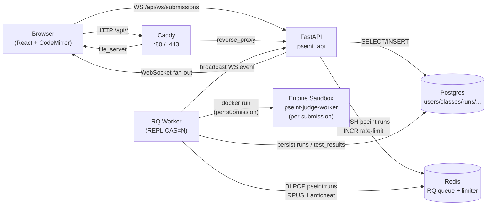

# pseint-judge

A Codeforces-style online judge for the PseInt pseudocode dialect.
Submissions are graded by a deterministic interpreter (`engine/`) that counts
engine steps and buckets them into the SPEC §(k) complexity bands (`OK` /
`ALTA` / `EXCESIVA`); verdicts (`AC` / `WA` / `TLE` / `RE` / `CE`) and a
text-similarity anticheat report round out the picture.  The platform is
teacher + student + admin via a FastAPI backend and a React + CodeMirror
frontend, all behind a Caddy reverse proxy and a stateless RQ worker pool.

The platform is **LOCAL-FIRST**: every acceptance check below runs on a
developer laptop with `DOMAIN` unset (`http://localhost`).  The UNAM
production switch-over is a separate post-plan step documented at the
bottom of this README.

---

## 1. Local quickstart

Five commands, ~5 minutes on a clean laptop.

### Prerequisites

- Docker + Docker Compose v2 (the stack runs in containers).
- Python 3.11+ for the seed script and CLI tools.

### Steps

```bash
# 1. Clone
git clone <repo-url> pseint-judge && cd pseint-judge

# 2. Local env file (gitignored).  Generate a real SECRET_KEY before
#    exposing the stack to anything other than localhost.
cp infra/.env.example infra/.env
python -c "import secrets; print('SECRET_KEY=' + secrets.token_urlsafe(48))" >> infra/.env
# Edit infra/.env: set ADMIN_PASSWORD=... (anything non-default).

# 3. Build images (engine sandbox image first; the worker spawns it
#    per submission, so a stale image = stale engine).
docker build -f infra/Dockerfile.worker -t pseint-judge-worker:latest .
docker build -f web/api/Dockerfile -t pseint-judge-api:latest .
docker build -f web/frontend/Dockerfile -t pseint-judge-frontend:latest .

# 4. Bring the stack up.
cd infra && docker compose up -d && cd ..

# 5. Install the python packages + run migrations + seed demo data.
pip install -e engine judge web/api
(cd web/api && alembic upgrade head)
python scripts/seed.py
```

### Verify

```bash
# Health probes
curl -sf http://localhost/healthz        # → 200
curl -sf http://localhost/readyz         # → 200 once postgres + redis are up

# Smoke probe (one-shot, exits 0 on green)
./infra/scripts/smoke.sh
```

Open `http://localhost` in a browser.  The demo credentials (seeded by
`scripts/seed.py`) are:

| Role     | Username    | Password    |
|----------|-------------|-------------|
| Admin    | `admin`     | `admin`     |
| Teacher  | `profe`     | `profe`     |
| Student  | `student01`-`student20` | `student123` |

These passwords exist ONLY to make the demo workflow one-click.  On any
real deployment replace them via the admin password-reset endpoint (see
`OPS.md` §6) before exposing the stack to anyone outside localhost.

### Tear down

```bash
cd infra && docker compose down           # keep volumes (data preserved)
cd infra && docker compose down -v        # also drop the pgdata volume
```

---

## 2. Architecture



Roles:

- **Admin** — manage users, problems, contests, classes.
- **Teacher** — author problems + test cases, tie problems to classes as
  assignments, run contests, see the anticheat report.
- **Student** — register with a class code, solve assigned problems,
  participate in contests, view their own submission history.

Per the plan (M9), only the `worker` container mounts the Docker socket
for spawning engine sandboxes.  The `api` container has no socket access —
all sandbox execution hops through Redis + the worker.

---

## 3. Environment variables

All variables live in `infra/.env` (gitignored).  `infra/.env.example` is
the documented contract; copy it and edit the values that should differ
from the LOCAL defaults.

| Variable | Default | Purpose |
|----------|---------|---------|
| `POSTGRES_USER` | `pseint` | Postgres role (matches `docker-compose.yml`). |
| `POSTGRES_PASSWORD` | `pseint` | Postgres role password.  **Never commit.** |
| `POSTGRES_DB` | `pseint` | Database name. |
| `POSTGRES_HOST_PORT` | `127.0.0.1:5432:5432` | Host-side port forwarding for `psql`.  Loopback only; do not expose on a public host. |
| `SECRET_KEY` | (placeholder) | JWT signing key.  **MUST be ≥ 32 chars**; the API refuses to boot with the example placeholder or anything containing `replace-me`/`changeme`/`development` etc.  Generate with `python -c "import secrets; print(secrets.token_urlsafe(48))"`. |
| `ADMIN_USERNAME` | `admin` | Username for the bootstrap admin (seeded by `alembic upgrade head` if env vars are set). |
| `ADMIN_PASSWORD` | `changeme` | Bootstrap admin password.  The api refuses to start without this set.  Replace before exposing. |
| `CORS_ALLOW_ORIGINS` | (empty) | Comma-separated list of browser origins allowed to call the API cross-origin.  Empty = same-origin only.  Used only when the frontend is on a different origin than the API. |
| `REPLICAS` | `3` | In-process RQ worker count inside the worker container.  Standalone compose's `deploy.replicas` is a swarm-only no-op; this is what actually scales throughput.  Bump for burst tolerance (rule of thumb: 1 worker per ~0.5 sustained submissions/sec on a 2-vCPU host). |
| `WORKER_IMAGE` | `pseint-judge-worker:latest` | Engine sandbox image the wrapper spawns per submission.  Must match the tag used by `docker build -f infra/Dockerfile.worker`. |
| `LOG_LEVEL` | `INFO` | Python logging level for the api + worker containers. |
| `TOKEN_TTL_MINUTES` | `1440` | JWT access-token lifetime (24h default). |
| `DOMAIN` | (unset) | **HTTP / HTTPS toggle.**  Unset → Caddy serves plain HTTP on `:80` (LOCAL mode).  Set to e.g. `judge.example.unam.mx` → Caddy activates auto-HTTPS via Let's Encrypt (UNAM production mode, todo 40). |
| `CADDY_HTTP_PORT` | `80` | Host-side port for Caddy's HTTP listener. |
| `CADDY_HTTPS_PORT` | `443` | Host-side port for Caddy's HTTPS listener (only opened when `DOMAIN` is set). |
| `REDIS_HOST_PORT` | (unset) | Optional loopback port-forward for `redis-cli` debugging.  Never set on a public host. |

`docker-compose.yml` interpolates `${VAR}` defaults so an unset
variable falls back to the LOCAL value (`pseint`, `3`, `INFO`, etc.).
`${VAR:?error}` is used for `SECRET_KEY` / `ADMIN_PASSWORD` — compose
refuses to start if those are unset.

---

## 4. Daily loop

After the initial setup:

```bash
# Submit a single test solution
python -m pseint_engine.cli run path/to/program.psc

# Judge the same program against the corpus
pytest engine/tests -q

# Drive a 200-submission burst against the running stack
python scripts/loadtest.py

# Re-seed (idempotent; no-op if already seeded)
python scripts/seed.py

# End-to-end journeys against the live stack
cd web/frontend && npx playwright test e2e
```

`scripts/loadtest.py` enforces the plan's burst contract: every submission
reaches `status=done`, DB count matches `baseline + burst`, p95 verdict
latency < 60s, and worker CPU stays under 80% during the burst.

`scripts/backup.sh` produces a `pg_dump` gzipped dump to
`${BACKUP_DIR:-/var/backups/pseint}/pseint-*.sql.gz` and prunes dumps
older than 7 days.  See `OPS.md` §3 for the full backup + restore drill.

---

## 5. UNAM production switch-over

The plan accepts ONLY at the LOCAL gate (`docker compose up -d` with
`DOMAIN` unset → `http://localhost`).  The following changes are the
post-plan switch-over for the UNAM production host.  They are documented
here for the operator who inherits the host; the plan does NOT execute
them, and none of them are required for the local acceptance gate.

### 5.1 Enable HTTPS via `DOMAIN`

Set `DOMAIN=judge.example.unam.mx` in `infra/.env`.  Caddy reads the env
via `{$DOMAIN}` in the site block (see `infra/Caddyfile`):

- When `DOMAIN` is unset the site address falls back to `:80` and
  Caddy serves plain HTTP.
- When `DOMAIN` is set Caddy activates auto-HTTPS on the matching
  host, obtains a Let's Encrypt cert via ACME http-01, and auto-renews
  it before expiry.

DNS for the host must point to the production server before the cert
challenge can succeed.

### 5.2 Firewall + brute-force defense

The local stack does not need a firewall.  On the production host:

```bash
sudo ufw default deny incoming
sudo ufw default allow outgoing
sudo ufw allow from <ADMIN_CIDR> to any port 22 proto tcp   # SSH from admin scope
sudo ufw allow 80/tcp                                       # ACME http-01
sudo ufw allow 443/tcp                                      # HTTPS
sudo ufw enable

sudo apt install fail2ban
sudo systemctl enable --now fail2ban
sudo fail2ban-client status sshd                            # verify jail
```

`ufw` allows 80 (for ACME challenges) and 443 only.  Postgres / Redis /
8000 are reachable only on the compose internal network and must NOT be
exposed on the host.

### 5.3 Off-host backups

`scripts/backup.sh` writes to `${BACKUP_DIR:-/var/backups/pseint}/`.
Set `BACKUP_DIR=/var/backups/pseint` in `infra/.env` and install a cron
entry on the production host that copies the dumps off-site:

```cron
# /etc/cron.d/pseint-backup — daily 02:00 UTC, push off-host after local dump
SHELL=/bin/bash
PATH=/usr/local/sbin:/usr/local/bin:/usr/sbin:/usr/bin:/sbin:/bin

0 2 * * * root cd /opt/pseint-judge && scripts/backup.sh /var/backups/pseint \
  && rsync -a --delete /var/backups/pseint/ backup@backup.example.unam.mx:/srv/pseint-judge/
```

Replace `backup@backup.example.unam.mx:/srv/pseint-judge/` with the
admin-chosen off-host target (NFS, S3, scp to a bastion).  The plan
validates the dump chain end-to-end with `scripts/backup.sh --restore`
into a scratch DB (see `OPS.md` §4); it does NOT install the cron
itself.

### 5.4 Other prod-only knobs

- `CORS_ALLOW_ORIGINS=https://<DOMAIN>` — if the frontend and API are
  on different origins.
- `DOCKER_GID` override on the worker container — restricts the
  `/var/run/docker.sock` mount to the host's docker group (see
  `OPS.md` §8).  Get the GID with `stat -c '%g' /var/run/docker.sock`.
- DB pool tuning for `REPLICAS > 12` — see `OPS.md` §7.

### 5.5 Plan acceptance vs prod acceptance

The plan's success gate (LOCAL) is:

```bash
docker compose config --quiet                                       # exit 0
curl -sf http://localhost/healthz                                    # 200
curl -sf http://localhost/readyz                                     # 200 (once DB+Redis up)
python scripts/seed.py                                               # prints [22, 1, 4, 1]
python scripts/loadtest.py                                           # exit 0, p95 < 60s
npx playwright test e2e                                              # 6 journeys green
```

Production acceptance is a separate exercise: the operator repeats the
same probes against `https://<DOMAIN>` and verifies `OPS.md` §10 (Caddy
auto-renew).  The plan does not gate on the production host.

---

## 6. Project layout

```
engine/        Python interpreter: tokenizer -> AST -> executor
judge/         Verdict + complexity + scoreboard + similarity engine
web/api/       FastAPI: persistence, auth, REST + WebSocket, rate limit
web/frontend/  React + TS + Vite, CodeMirror 6 PseInt mode
infra/         docker-compose, Caddyfile, Dockerfiles, worker entrypoint
e2e/           Playwright journeys (against the local compose stack)
scripts/       seed.py (todo 41), loadtest.py (todo 37), backup.sh (todo 40)
tests/         Cross-cutting tests (compose shape, seed, loadtest, secrets, ...)
spec/          PseInt dialect spec (SPEC §(a)-(k))
OPS.md         Operations runbook (deploy, upgrade, backup, restore, ...)
.omo/          Plan, drafts, evidence receipts, notepads
```

The plan file (`.omo/plans/pseint-judge.md`) is the authoritative spec
for every behavioral choice in the repo; conflicts between this README
and the plan resolve in favor of the plan.

---

## 7. Demo credentials + sample data

The seed script (`scripts/seed.py`) creates a deterministic demo state
with the credentials in §1 above, one class (`ABC123` / `Class Alpha`),
20 enrolled students, four problems (HolaMundo / Suma / Primo /
Fibonacci), two assignments, and one running CF-mode contest seeded
with planted runs:

- The O(n) reference Fibonacci solution from `student01`.
- A deliberately quadratic (O(n²)) Fibonacci solution from `student03`
  — same output, but the planted run lands in the `ALTA` complexity band.
- A deliberately exponential (O(2ⁿ)) Fibonacci solution from
  `student04` — same output, but the planted run lands in the
  `EXCESIVA` band.
- A planted copy pair (same algorithm, renamed identifiers) from
  `student01` and `student02` — used by the anticheat report's diff
  viewer (todo 25 + 39) to demonstrate similarity scoring.

To re-seed (no-op if already seeded): `python scripts/seed.py`.  The
final printed line is the count assertion gate: `[22, 1, 4, 1]`.
